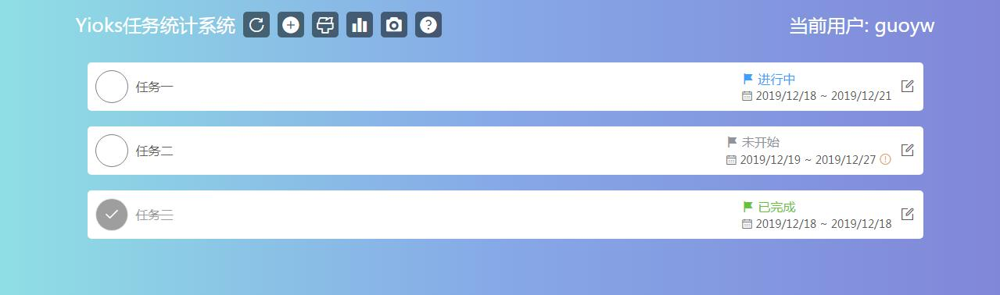
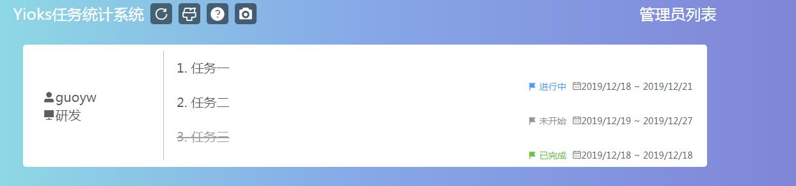

# oa-task-statistical 任务统计管理
## 描述
通过ip或者用户名实现自动登录，分条记录任务，实现任务统计。

## 功能描述
+ 实现Ip自动登录
+ 实现姓名自动登录（权限控制）
+ 添加|编辑单项任务
+ 任务状态提醒
+ 任务统计管理（支持设置管理员权限）

## 前端代码
[@smallsunnyfox](https://github.com/smallsunnyfox/oa-task-statistics)

## 详情

